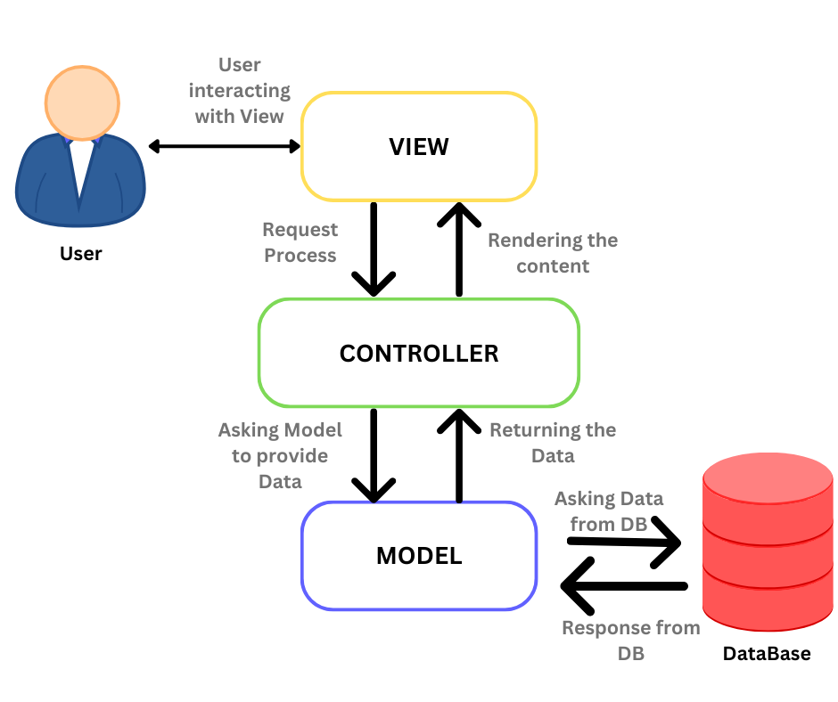

**Definition**: MVC is an architectural pattern used by developers to organize backend code into separate folders and files based on their roles and responsibilities, rather than placing all functionalities in a single file.

- **M** (Model): This folder contains files responsible for interacting with the database.
- **V** (View): This folder includes files that manage what the user sees, often using templates to dynamically generate HTML elements for display.
- **C** (Controller): This folder holds files that act as intermediaries between the Model and View, processing user requests and sending appropriate responses.

## Analogy

Imagine a house with different rooms designed for specific activities, rather than one large room for everything. Similarly, MVC organizes code into distinct folders, each containing files that focus on specific tasks, making it easier to manage, edit and maintain.

Instead of having all code flow through a single file (like `server.js`), MVC allows:

- **Model** to handle database interactions.
- **Views** to manage what the user sees.
- **Controller** to coordinate communication between the Model and the View.

---

## Problems Solved by MVC

- **Team Collaboration**: MVC allows multiple developers to work on different parts of the project simultaneously without interfering with each other’s work.
- **Debugging**: With modular components, it's easier to identify and fix errors without impacting the entire system.
- **Interchangeability**: The code structure is flexible, making it easier to update or replace individual components.

---

## Organizing Code

When writing code, developers naturally organize it by indenting and separating different sections. MVC formalizes this process, making the code easier to navigate and modify.

## Separation of Concerns

MVC helps ensure that each part of the application has a distinct responsibility. Developers know exactly where to go when they need to make changes:

- **CSS**: For styling and design.
- **HTML**: For adjusting content and structure.
- **JavaScript**: For handling interactivity and behavior.

---

## The Role of the Router

The router is the first touchpoint for a client’s request. It listens for incoming requests, interprets the URL, and forwards the request to the appropriate controller.

- The router ensures requests are directed to the correct handler based on the URL.

---

## Conclusion

The MVC architecture offers several advantages, especially in projects where clear separation of responsibilities is crucial. Its modular structure allows for easier collaboration between team members, improved maintainability, and faster debugging. 

### Advantages of MVC:

1. **Scalability**: MVC makes it easier to scale applications by dividing them into distinct components (Model, View, Controller) that can be worked on independently.
2. **Teamwork**: Developers can work on different layers (frontend, backend) simultaneously without causing conflicts.
3. **Reusability**: MVC promotes reusability of code components, especially in Views and Controllers.
4. **Easier Debugging**: Errors are easier to locate and fix, since issues in one component do not necessarily affect the others.

### Best Scenarios for Applying MVC:

- **Web Applications**: MVC is particularly suited for web development where there is a need to separate logic, interface, and data access.
- **Large-Scale Projects**: MVC works best when the project involves multiple developers or needs clear separation between different parts of the code.
- **Projects with Frequent Changes**: When a project requires frequent updates to the UI or business logic, MVC’s structure ensures these changes can be made without affecting the whole system.

In summary, MVC provides an organized approach to coding that enhances maintainability, collaboration, and scalability, making it a preferred choice for both small and large development projects.

---

Finally, feel free to follow me on [LinkedIn](https://www.linkedin.com/in/adel-abdulazeem/) for updates on development progress and to share some web development news.
